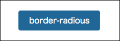
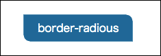
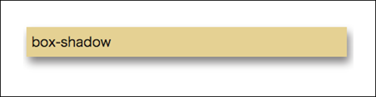

# CSS3

## CSS3について
 これまでのCSSに「新しく便利な仕様を加えたもの」がCSS3です。基本的記述方法に変化はありませんから、これまでのCSSの知識はそのまま使うことができます。

## CSS3で追加されたプロパティ

### 角丸

#### border-radious

画像やボックス要素を角丸にするにはborder-radiousを使用します。角丸の半径の数値は「px」「em」「pt」「%」で指定できます。

```css
.button   {  
    border-radius: 4px;
    -webkit-border-radius: 4px;    /* Safari,Google Chrome用 */  
    -moz-border-radius: 4px;   /* Firefox用 */  
}
 ```




#### border-radious

角丸の半径を個別で指定できます。個別で指定した場合は「左上」「右上」「右下」「左下」です。

```css
.button   {
    -webkit-border-radius:0 4px 0 4px;
    -moz-border-radius:0 4px 0 4px;  /* Safari,Google Chrome用 */
    border-radius:0 4px 0 4px;     /* Firefox用 */
}
```




### 影

#### box-shadow

box-shadowプロパティでは要素に1つまたは複数の陰をつけることができます。基本的な設定は以下の通りです。

```
box-shadow: 3px 7px 15px #838182;
```

基本的な設定は「box-shadow:　水平方向のオフセット値　垂直方向のオフセットの値　ぼかし距離　カラー値」です。




## CSS3だけでできるマウスオーバーアニメーション

CSS3だけでできるマウスオーバーアニメーションを作成しました。

http://pinoqo.sakura.ne.jp/git/button/index.html

### ベースのボタン指定

```css
.btn_base {
	color: #fff;
	text-align: center;
	display: block;
	text-decoration: none;
	font-weight: normal;
	background-color: #006699;
}
```

### 奥に一回転するアニメーション

```css
.btn01 {
	color: #fff;
	text-decoration: none;
	display: block;
	height: 40px;
	line-height: 40px;
	/* ここで動く速度とか設定 */
	transition: all 1s ease;
	-webkit-transition: all 1s ease;
	left: 230px;
	position: relative;
	border-radius: 5px;
	width: 160px;
}
.btn01:hover {
	transform: rotate(720deg);
	-webkit-transform: rotate(720deg);
}
```

> くるっと１回転したい場合は「rotate」を360にすればOKです。


#### 回転アニメーション

```css
.btn02 {
	width: 200px;
	position: relative;
	perspective: 300px;
	-webkit-perspective: 300px;
}
.btn02 span {
	background-color: #006699;
	display: block;
	width: 160px;
	padding: 8px 0;
	position: absolute;
	top: 0;
	backface-visibility: hidden;
	-webkit-backface-visibility: hidden;
	transition: 0.8s;
	left: 230px;
	border-radius: 5px;
}
.btn02 .back {
	background-color: #006699;
	transform: rotateY(180deg);
	-webkit-transform: rotateY(180deg);
}
.btn02:hover .front {
	transform: rotateY(180deg);
	-webkit-transform: rotateY(180deg);
}
.btn02:hover .back {
	transform: rotateY(360deg);
	-webkit-transform: rotateY(360deg);
}
```

### 震えるアニメーション

```css
.btn03 {
	text-decoration: none;
	width: 160px;
	padding: 8px 0;
	border-radius: 4px;
	-webkit-border-radius: 4px;    /* Safari,Google Chrome用 */
	-moz-border-radius: 4px;   /* Firefox用 */
	margin-left: 230px;
}
.btn03:hover {
	animation: shake 0.2s linear infinite;
	-webkit-animation: shake 0.2s linear infinite;
}
@keyframes shake {
    0% {
         transform: translate(3px, 2px) rotate(0deg);
    }
    10% {
         transform: translate(-2px, -3px) rotate(-1deg);
    }
    20% {
         transform: translate(-4px, 0px) rotate(1deg);
    }
    30% {
        transform: translate(0px, 3px) rotate(0deg);
    }
    40% {
        transform: translate(2px, -2px) rotate(1deg);
    }
    50% {
        transform: translate(-2px, 3px) rotate(-1deg);
    }
    60% {
        transform: translate(-4px, 2px) rotate(0deg);
    }
    70% {
        transform: translate(3px, 2px) rotate(-1deg);
    }
    80% {
        transform: translate(-2px, -2px) rotate(1deg);
    }
    90% {
        transform: translate(2px, 4px) rotate(0deg);
    }
    100% {
        transform: translate(2px, -3px) rotate(-1deg);
    }
}
```
