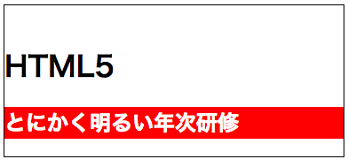

# HTML5

## HTML5について

HTML5を使えば、これまで複雑だった処理を簡単に記述できるだけでなく、より構造的にHTMLを記述することができるようになります。また、HTML5ではWebページに図形を描画できるcanvasタグなど、動画や音声といったマルチメディアコンテンツを扱うタグが追加されました。

## 書式について

### DOCTYPE宣言の記述

DOCTYPE宣言では大文字と小文字は区別されません。HTML5の仕様では、DOCTYPE宣言はブラウザの表示モードを標準モードにします。DOCTYPE宣言が無いと、一般的なブラウザではレンダリングモードが互換モードとなります。

ブラウザのレンダリングモードとは、ウェブページの表示方法を決めるブラウザの状態のことで、 DOCTYPE宣言の記述の方法によって標準モードと互換モードが切り替わります。

標準モードは、CSSなどの仕様どおりに正しく表示するモードです。

互換モードは、まだCSSが普及していなかった時代の過去のブラウザとの互換のために、 あえて標準仕様とは異なる解釈で表示するモードのことです。

>「DOCTYPE宣言」参考サイト
http://www.agr.hokudai.ac.jp/useful/TAG/a0_doctype.htm


### html要素

DOCTYPEの次にhtml要素を記述します。html要素は、HTML文章の全体を指す要素です。

### head要素

html要素の中には、head要素を含む必要があります。head要素にはメタ情報を記述できます。記述するメタ情報の中には、サーチエンジン向けのキーワードなどを含めることがあります。

### meta要素

meta要素は文字コードの指定など、文章に付随するメタ情報を記述するのに使用します。

HTML文章の文字コードは、meta要素の`charset`属性で指定します。`<head>` タグの最初に記述します。先に`<title>` を記述した場合、 `<title>`に書いたテキストが正しく認識されない場合があります。

HTML5では文字コードの指定としてUTF-8を推奨しています。

```html
<!DOCTYPE html>
<html>
  <head>
    <meta charset="utf-8">
    <title>HTML5</title>
  </head>
</html>

```

### style要素

style要素にはscoped属性が追加されました。scoped属性をした場合、文章全体に対してではなく、style要素の親要素と子孫要素に対してにのみスタイルが適用されます。また、この場合type属性の指定は不要になりました。

```html
 <body>
   <style scoped>
   h2{
     background-color:red;
     color:white;
   }
   </style>
<h1>HTML5</h1>
<h2>とにかく明るい年次研修</h2>
</body>
<!--開始タグと終了タグ-->
```




### 省略可能な要素

HTML5としては必要最低限の記述は以下のとおりです。

```html
 <!DOCTYPE html>
<title>タイトル</title>
```

 `<html><head><body>`が省略できるのは、少し違和感がありますが、省略してもブラウザは適切に表示できます。


| 省略可能な要素  | タグ  |
|:-----------|:------------|
| タグ両方省略可能な要素       |  &lt;html&gt;　&lt;head&gt;　&lt;body&gt;　&lt;tbody&gt;　&lt;colgroup&gt; |
| 終了タグが省略可能な要素    | &lt;li&gt;  &lt;dt&gt; &lt;dd&gt; &lt;p&gt;  &lt;colgroup&gt;|
| 開始タグだけで使用する要素  | &lt;br&gt; &lt;img&gt; &lt;hr&gt; &lt;meta&gt; &lt;area&gt; &lt;base&gt; &lt;link&gt; &lt;embed&gt; |


### 閉じスラッシュ

`<br>`や``の記述は以下のとおりです。

```


```

img要素はHTML5で閉じスラッシュ不要ですが付与しても構いません。

また、img要素については、これまで必須とされていたalt属性は必須ではなくなりました。ただし、検索エンジンの最適化やアクセシビリティ向上のためには、画像の内容を正確に記述する必要があるでしょう。


## 属性について

```html
 <html lang="ja">
<!--lang属性=言語コードを指定。jaは日本語-->
```

属性は1つでなく複数指定することもできます。その場合は「属性名="属性値"」の後に半角スペースを入れます。


### グローバル属性

グローバル属性とは、すべての要素に共通して使用できる属性です。HTML5で新たに追加されたグローバル属性は以下のとおりです。

|属性名   |   内容|
|:----------|:-------------|
|contenteditable  | 編集可能/不可を指定|
|draggable  | ドラッグの有効/無効を指定|
|spellcheck  | スペルチェックの有効性|
|hidden | 関係、無関係を指定|


## カテゴリーについて

これまでのHTMLでは、要素は**ブロック要素**と**インライン要素**で分かれていて、インライン要素の中にはブロック要素を含むことができませんでした。

HTML5ではブロック要素とインライン要素が廃止されました。その代わりに、HTML5では要素を文章構造の意味で細かく分類したカテゴリーが定義されています。

+ Metadata content
    + base; link; meta; noscript; script; style; template; title
+ Flow content
    + a; abbr; address; article; aside; audio; b; bdi;...
+ Sectioning content
    + article; aside; nav; section
+ Heading content
    + h1; h2; h3; h4; h5; h6
+ Phrasing content
    + a; abbr; audio; b; bdi; bdo; br; button; canvas;...
+ Embedded content
    + audio canvas embed iframe img math object svg video
+ Interactive content
    + a; button; embed; iframe; keygen; label; select; textarea;
+ Sectioning roots
    + blockquote; body; fieldset; figure; td
+ Form-associated elements
    + button; fieldset; input; keygen; label; object; output; select; textarea; img
+ Listed elements
    + button; fieldset; input; keygen; object; output; select; textarea
+ Submittable elements
    + button; input; keygen; object; select; textarea
+ Resettable elements
    + input; keygen; output; select; textarea
+ Labelable elements
    + button; input; keygen; meter; output; progress; select; textarea
+ Reassociateable elements
    + button; fieldset; input; keygen; label; object; output; select; textarea
+ Palpable content
    + a; abbr; address; article; aside; b; bdi; bdo; blockquote; button;...
+ Script-supporting elements
    + script; template

HTML5の各要素は1つ以上のカテゴリーに属しています。

> HTML5のカテゴリについては以下に記載があります。
http://www.w3.org/TR/html5/index.html#element-content-categories

## 要素とセマンティクスについて

HTML5のセマンティクスとは、文章の構造（アウトライン）に従って要素の意味付けを明確にしてマークアップすることをいいます。つまり、人間だけでなく、コンピュータでも理解できるHTMLの文書構造を作ろう！というのがセマンティックなWebの考え方です。

これまでのHTMLではdivタグなどに対して、idやclassを付けることでアウトラインを管理することが一般的でしたが、HTML5からはアウトラインを形成するsection要素などが導入されたことで、アウトラインを明示的に管理できるようになりました。

ここではセマンティックなwebを構築するために、HTML5で追加されたタグを紹介します。

### section要素

section要素はマークアップされた箇所が1つのセクションであることを示します。セクションは書籍でいうところの章や節などのテーマの区切りです。セクションを使うことで文章の階層構造が明確になります。section要素には`<h1>〜<h6>`要素を含めることが一般的です。

### header要素

hearder要素には文章の要約や、目次のようなナビゲーションを含みます。そのためhearder要素はHTMLページの先頭部分に配置される傾向にあります。

> header要素はアウトラインを生成しません。

### nav要素

Webサイトにおける「ナビゲーション」とはWebサイト内でのリンクの集まりを意味します。nav要素はページのヘッダーやサイドバーなどに配置して、Webサイト全体に関するナビゲーションとして使用します。

### article要素

article要素は単体で内容が完結するセクションを意味します。ブログサイトでは、1つの記事をarticle要素で定義したり、「最近の記事一覧」のように複数の記事のダイジェストを1つにまとめるためにaiticle要素を使用することもできます。


```html
<article>
  <h1>HTML5</h1>
  <p>とにかく明るい年次研修</p>
  <section>
     <h2>ニュース1</h2>
     <p>身長が伸びました!</p>
  </section>
  <section>
     <h2>ニュース2</h2>
     <p>小人に会いました!</p>
  </section>
</article>
```

### main要素

main要素はその文章のメインコンテンツであることを表します。HTML文章内でmain要素はbody内に1つしか存在しません。

> main要素はアウトラインを生成しません。

## 参考文献

+ HTML教科書　HTML5 レベル1
+ HTML5+CSS3の新しい教科書
