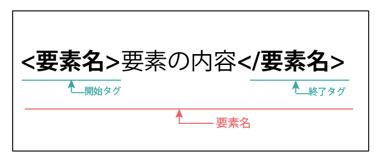

# HTML5
### HTML5について
**HTML5はこれまでのHTMLに比べて記述がシンプルになります。<br />
今まで複雑だった処理が簡単に出来て、HTMLをより構造的に記述することができます。例えば、Webページに図形を描画できる「Canvas」など動画や音声、グラフィックの描画が可能になります。**

<br />

 ### 書式のルール

####  ・DOCTYPE宣言の記述

大文字と小文字は区別されません。HTML5の仕様では、DOCTYPE宣言はブラウザの表示モードを標準モードにします。DOCTYPE宣言が無いと、一般的なブラウザではレンダリングモードが互換モードとなります。

※ブラウザのレンダリングモードとは<br />
ブラウザのレンダリングモードとは、ウェブページの表示方法を決めるブラウザの状態のことで、 DOCTYPE宣言の記述の方法によって標準モードと互換モードが切り替わります。<br /> 標準モードは、CSSなどの仕様通りに正しく表示するモードです。<br />
互換モードは、まだCSSが普及していなかった時代の過去のブラウザとの互換のために、 あえて標準仕様とは異なる解釈で表示するモードのことです。<br />
###### ※「DOCTYPE宣言」参考サイト("http://www.agr.hokudai.ac.jp/useful/TAG/a0_doctype.htm")

#### ・タグと要素
タグとは”<”記号と”>”記号で囲った要素名を示します。




上記の場合、タグの中が要素となります。<br />
<br />

#####要素
・html要素

DOCTYPEの次に、html要素を記述します。
html要素は、HTML文章の全体を表す要素です。

・head要素

head要素はhtml要素の中に必ず一つ、含める必要があります。記述するメタ情報の中には、サーチエンジン向けのキーワードなどを含めることがあります。

・meta要素

meta要素は文字コード指定など、文章に付随するメタ情報を記述するのに使用します。
文字コーソの属性指定は、meta要素の `charset属性` でします。`<head>` タグの最初に記述します。
先に`<title>` を記述した場合、 `<title>`に書いたテキストが正しく認識されない場合があります。
HTML5では、UTF-8の指定を推奨しています。
```html
<!DOCTYPE html>
<html>
  <head>
    <meta charset="utf-8">
    <title>HTML5</title>
  </head>
</html>

```
<br />

・style要素

style要素には scoped属性が追加されました。
scoped属性をした場合、文章全体に対してではなく、style要素の親要素と子孫要素に対してにのみスタイルが適用されます。
また、この場合type属性の指定は不要になりました。


```html
 <body>
   <style scoped>
   h2{
     background-color:red;
     color:white;
   }
   </style>
<h1>HTML5</h1>
<h2>とにかく明るい年次研修</h2>
 </body>
 <!--開始タグと終了タグ-->

```


<br />
##### タグ
```html
 <要素名>要素の内容</要素名>
 <!--開始タグと終了タグ-->
```

DOCTYPE宣言の下に、Webサイトの中身となる要素(タグ)を記述します。
タグとは"<"記号と">"記号で要素名を指し、
タグには開始タグと要素名の前にスラッシュ("/")が入った終了タグがあります。

・省略可能な要素

HTML5としては必要最低限の記述は以下の通りです。
```html
 <!DOCTYPE html>
<title>タイトル</title>

```
 `  <html> <head> <body>  ` が全くないのは、ちょっと変な感じもしますが、省略したとしてもブラウザで表示されます。

<br />

| 省略可能な要素  | タグ  |
|:-----------|:------------|
| タグ両方省略可能な要素       |  &lt;html&gt;　&lt;head&gt;　&lt;body&gt;　&lt;tbody&gt;　&lt;colgroup&gt; |
| 終了タグが省略可能な要素    | &lt;li&gt;  &lt;dt&gt; &lt;dd&gt; &lt;p&gt;  &lt;colgroup&gt;|
| 開始タグだけでが省略可能な要素  | &lt;br&gt; &lt;img&gt; &lt;hr&gt; &lt;meta&gt; &lt;area&gt; &lt;base&gt; &lt;link&gt; &lt;embed&gt; |

<br />
・閉じスラッシュについて

`<br>`や``の記述は以下の通りです。
```


```
img要素はHTML5で閉じスラッシュ不要ですが、あっても混在でもOKです。また、alt属性は必須ではなくなりました。検索エンジンやアクセシビリティ向上の為には、画像の内容を正確に記述する必要があります。

<br />
#### ・属性
```html
 <html lang="ja">
<!--lang属性=言語コードを指定。jaは日本語-->

```
属性は1つでなく複数指定することもできます。その場合は「属性名="属性値"」の後に半角スペースを入れます。


・グローバル属性
グローバル属性とは、どの要素にも共通して使用できる属性の事です。
HTML5で新たに追加されたグローバル属性は以下の通りです。

属性名   |   内容
:----------|:-------------|
contenteditable  | 編集可能/不可を指定
draggable  | ドラッグの有効/無効を指定
spellcheck  | スペルチェックの有効性
hidden | 関係、無関係を指定
```html
 <要素名>要素の内容</要素名>

```

<br />
#### ・カテゴリーについて
これまでは**ブロック要素**と**インライン要素**で分け、インライン要素の中にはブロック要素
を含むことができませんでした。
HTML5では要素を文章構造の意味で小マック分類したカテゴリーが定義されています。<br />
HTML5の要素はカテゴリーの各要素に属しています。<br />
※ **ブロック要素**-要素を構成する1つのブロックとして認識される要素。<br />
　**インライン要素**-ブロック要素の中に含まれる内容として表される要素。<br />
 　HTML5ではブロック要素とインライン要素が廃止されました。<br />


#### ・要素とセマンティクス
セマンティクスとは、文章の内容に沿って要素の意味付けを明確にしてマークアップすることをいいます。

#### ・section要素
セクション要素はHTML5で追加された要素です。
マークアップされた箇所が1つのセクションであることを示します。<br />
セクションは書籍でいうところの章や節などのテーマの区切りです。セクションがあることで階層構造が明確になります。
通常、section要素として` <h1> 〜 <h6> `要素を含めることとによって認識されます。

#### ・header要素
header要素はセクションに対して1度だけ記述出来る要素です。
また、header要素はセクショニング要素ではないためアウトラインを生成しません。<br />

※**アウトライン**-セクション要素を使い、セクションの入れ子構造で構築された文章構造のことをいいます。
今まではdivタグに対して、idやclassを付けてマークアップしていたものが、html5のセクション要素の登場により、section要素などで意味を付けることが出来るようになりました。` <h1> 〜 <h6> `などの要素で階層が変わっていましたが、section要素などは、アウトラインつまり階層が変わりません。


#### ・nav要素
nav要素はHTML5で追加された要素です。<br />
主にWebサイトにおける「ナビゲーション」とはWebサイト内でのリンクの集まりをいいますが、
nav要素はページのヘッダー部分や左右サイドなど、Webサイト全体に関する主要なナビゲーションに対してのみ使用します。<br />
また、header要素はセクショニング要素ではないためアウトラインを生成しません。
  #### ・article要素
  article要素は単体で内容が完結するセクションを表します。ブログの投稿やニュースサイトなどで、複数の記事を1つにまとめるために<aiticle>　要素でマークアップします。


  ```html

<article>
    <h1>HTML5</h1>
    <p>とにかく明るい年次研修</p>
  <section>
     <h2>ニュース1</h2>
     <p>身長が伸びました!</p>
   <section>
     <h2>ニュース2</h2>
     <p>小人に会いました!</p>
   </section>
 </article>

  ```


  #### ・main要素
  main要素はその文章のメインコンテンツであることを表します。<br />
  HTML文章内で` main要素 `はbody内に1つしか存在しません。
  また、セクショニング・コンテンツではないのでアウトラインを形成しません。
人だけじゃなく、コンピュータでも理解できる文書構造を作ろう！というセマンティックなwebの考え方です。
<br />
######参考文献
吉川 徹, 窪田 則子, 秋葉 秀樹, 白石 俊平（2014)『HTML教科書　HTML5 レベル1』国宝社<br />
赤間 公太郎, 原 一宣。, こもり まさあき（2013)『HTML5+CSS3の新しい教科書』MDN
