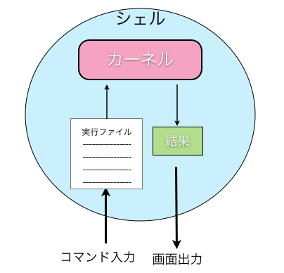
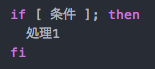
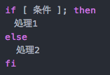
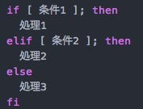
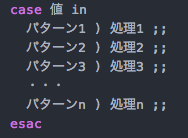
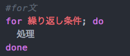
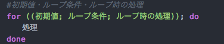
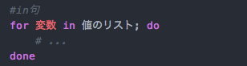
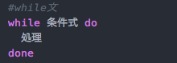

# bashシェルスクリプト

## 事前知識

### シェルとは
シェルとはユーザーから入力されたコマンドを解釈し、 プログラムを起動するアプリケーションです。
UNIX/Linuxの中核（カーネル）の機能を使って、ユーザーは様々な処理を行っています。
しかし、カーネル自身にはユーザーと直接やり取りを行う機能が無いため、シェルが仲介役としてユーザーとカーネルのやり取りを行います。
UNIX/Linuxにおいて、ユーザーから入力されるコマンドはシェルによって実行ファイルが実行されることを意味しています。

イメージ図

   

シェルには数々の種類があります。


シェル一覧

|種類|説明|
|:--|:--|
|sh|Bourneシェル(Bシェル)と呼ばれており、必要最低限の機能を持ったシェルです。現在ではログインシェルとして使われることはほとんどありませんが、シェルスクリプトを書くために使われています。|
|bash|shシェルの上位互換シェルです。|
|csh|C言語スタイルの構文を持つシェルです。Bourneシェルとは互換性がなく、同じ機能でもその構文が異なります。|
|ksh|shシェルの上位互換シェルです。|
|tcsh|cshシェルの上位互換シェルです。|
|zsh|bashシェルやtcshシェルなどの機能を持ったシェルです。|

今回は多くのUNIX系OSで標準的に使われるbashシェルについて勉強します。


　
### シェルスクリプトとは
シェルスクリプトとはシェルへのコマンド入力をまとめて記述したスクリプト言語です。スクリプト言語とは、機械語への変換や実行ファイルの作成などの過程を省略し、簡易的に実行出来るプログラムのことを指します。

　　
## bashシェルでHelloWorld
まずは画面に HelloWorld を出力するスクリプトを作成します。

実行環境は下記

OS : Mac OS X

#### 1.hello.shファイルを作成

　・ ターミナルを起動後、下記のコマンドを実行し、viエディタを起動

```
vi hello.sh
```

　・ viエディタ起動後、下記のスクリプトを記述して保存

```
#!/bin/sh
echo "Hello World!"
```


#### 2.hello.shファイルの実行権限を変更

　・ ファイルに実行権限を与えるため、下記のコマンドを実行

```
chmod a+w hello.sh
```


#### 3.helloWorld.shファイルを実行

　・ スクリプトファイルの実行するには下記のコマンドを実行
```
./hello.sh
```

#### 4.実行結果
```
Hello World!
```
  　  
※　1で記述されているスクリプトの先頭の #!/bin/sh は、"bashシェルで起動します"という宣言であり、これを記述しないとbashシェルではなく、Bシェルで起動されてしまいます。

　
##  演算や比較や結合

### 算術演算子
シェルスクリプト上で算術演算子を使用するには下記ように記述します。

|演算子|意味|
|:--|:--|
|+|足し算|
|-|引き算|
|*|掛け算|
|/|割り算|
|%|余り|

　
##### スクリプト（operation1.sh）
```
#!/bin/bash

#足し算
add=`expr 1 + 1`
echo "1 + 1 = $add"

#引き算
sub=`expr 3 - 1`
echo "3 - 1 = $sub"

#掛け算
mul=`expr 2 \* 3`
echo "2 * 3 = $mul"

#割り算
div=`expr 6 / 3`
echo "6 / 3 = $div"

#余り
tom=`expr 5 % 3`
echo "5 % 3 = $tom"

```


##### 実行結果

```
tatsuya:sh tatsuya$ ./operation1.sh
1 + 1 = 2
3 - 1 = 2
2 * 3 = 6
6 / 3 = 2
5 % 3 = 2

```
##### 解説
演算子を使用する時に気をつけないといけないことは、演算子の前後に半角スペースが必要となることです。
演算子の前後に半角スペースを入力しないと文字列として認識されてしまいます。
また、計算結果や文字列の編集結果などを変数に格納する場合は、`(バッククォート)を使用します。


　　
### 数値の比較
シェルスクリプト上で数値を比較する場合、下記のように記述します。

|演算子|意味|
|:--|:--|
|-eq|等しい|
|-ne|等しくない|
|-gt|より大きい|
|-lt|より小さい|
|-ge|以上|
|-le|以下|


　
##### スクリプト（operation2.sh）
```
#!/bin/bash

a=`expr 1 + 1`

#等しい
if [ "$a" -eq 2 ]; then
  echo "変数aは2と等しい"
fi

#等しくない
if [ "$a" -ne 1 ]; then
 echo "変数aは2と等しくない"
fi

#より大きい
if [ "$a" -gt 1 ]; then
 echo "変数aは1より大きい"
fi

#より小さい
if [ "$a" -lt 3 ]; then
 echo "変数aは2より小さい"
fi

#以上(等しいも含むため、あえて同一の値で)
if [ "$a" -ge 2 ]; then
 echo "変数aは2以上"
fi

#以下(等しいも含むため、あえて同一の値で)
if [ "$a" -le 2 ]; then
 echo "変数aは2以下"
fi
```
　
##### 実行結果
```
tatsuya:sh tatsuya$ ./operation2.sh
変数aは2と等しい
変数aは2と等しくない
変数aは1より大きい
変数aは2より小さい
変数aは2以上
変数aは2以下
```

##### 解説
先ほどの算術演算子と同様、比較演算子の前後にスペースを空けています。
また、変数を"(ダブルクォート)で囲んで変数に格納されている値を取得しています。

　　
### 文字列の比較
シェルスクリプト上で文字を比較する場合、下記のように記述します。

|比較方法|説明|
|:--|:--|
|文字列|文字列の長さが0より大きければ真|
|! 文字列|文字列の長さが0であれば真|
|文字列1 = 文字列2|文字列1と文字列2が等しければ真|
|文字列1 != 文字列2|文字列1と文字列2が等しくなければ真|


　
##### スクリプト（operation3.sh）
```
#!/bin/sh

str1=test1;
str2=;
str3=test2;
str4=test1;

#文字列の長さが0より大きい場合は真
if [ "$str1" ]; then
  echo "変数str1の文字列の長さは0より大きいです"
fi

#文字列の長さが0の場合は真
if [ !"$str2" ]; then
  echo "変数str2の文字列の長さは0です"
fi

#2つの文字列の値が同じ場合は真
if [ "$str1" = "$str4" ]; then
  echo "変数str1と変数str4は同じ値です"
fi

#2つの文字列の値が異なる場合は真
if [ "$str1" != "$str3" ]; then
  echo "変数str1と変数str3は同じ値ではありません"
fi


```

##### 実行結果
```
tatsuya:sh tatsuya$ ./operation3.sh
変数str1の文字列の長さは0より大きいです
変数str2の文字列の長さは0です
変数str1と変数str4は同じ値です
変数str1と変数str3は同じ値ではありません
```

　　
### 論理結合
論理結合演算子は下記のように記述します。

|比較方法|説明|
|:--|:--|
|条件1 -a 条件2|条件1が真、かつ条件2が真であれば真|
|条件1 -o 条件2|条件1が真、または条件2が真であれば真

　
##### スクリプト（operation4.sh）
```
#!/bin/sh

val1=3;
val2=5;

#論理積
if [ "$val1" -gt 2 -a "$val2" -gt 2 ]; then
  echo "変数val1、変数val2は2より大きいです。"
fi

#論理和
if [ "$val1" -gt 4 -o "$val2" -gt 4 ]; then
  echo "変数val1は4より小さいが、変数val2は4より大きい"
fi
```


##### 実行結果
```
tatsuya:sh tatsuya$ ./operation4.sh
変数val1、変数val2は2より大きいです。
変数val1は4より小さいが、変数val2は4より大きい
```


　　
## 条件分岐
スクリプトで条件分岐を行う時には if文、case文 を使用します。

### if文
スクリプトでif文を書く時の構文は以下となります。

・条件式が真の場合、処理を行う




・条件式が真の場合は処理1を行い、偽の場合は処理2を行う



・条件式1が真の場合は処理1を行い、条件式1が偽かつ条件式2が真の場合の場合は処理2を行い、それ以外の場合は処理3を行う



　　
##### スクリプト（if.sh）

```
#!/bin/bash

num1=6;
num2=5;

total=`expr $num1 + $num2`

#if 〜 elif 〜 else 文
if [ "$total" -eq 10 ]; then
  echo "変数totalは10です。"

elif [ "$total" -gt 10 ]; then
  echo "変数totalは10より大きいです。"

else
  echo "変数totalは10より小さいです。"
fi

```

　　
##### 実行結果
```
tatsuya:sh tatsuya$ ./if.sh
変数totalは10より大きいです。
```

　　
### case文
スクリプトでcase文を書く時の構文は以下となります。



　　
##### スクリプト（case.sh）
```
#!/bin/sh

a=test2

#以下case文
case "$a" in
 "test1" ) echo "変数aの値はtest1です";;
 "test2" ) echo "変数aの値はtest2です";;
 "test3" ) echo "変数aの値はtest3です";;
esac
```
　
##### 実行結果
```
tatsuya:sh tatsuya$ ./case.sh
変数aの値はtest2です
```

##### 解説
変数aに文字列を代入し、変数aとパターンに指定した文字列が完全に一致した場合、パターンに設定されている処理が実施されます。

　　
## 繰り返し処理
スクリプトで繰り返し処理を行う時には for文 、while文 を使用します。


### for文
スクリプトでfor文を書く時の構文は以下となります。



for文の書き方には繰り返し条件に初期値、ループ条件、ループ時の処理を記述する方法とin句を使用する方法があります。

　
+ 初期値、ループ条件、ループ時の処理

  

   スクリプト（for.sh）
  ```
  #!/bin/sh

  num=10

  #for文
  for ((i=0; i<"$num"; i++)); do
    echo "$i"
  done
  ```
   実行結果
  ```
  tatsuya:sh tatsuya$ ./for.sh
  0
  1
  2
  3
  4
  5
  6
  7
  8
  9
  ```
  　
+ in句

  

  スクリプト（for_in.sh）
  ```
  #!/bin/sh

  list1="1"
  list2="3"
  list3="5"

  # for(in句)
  for i in "$list1" "$list2" "$list3"; do
    echo "$i"
  done
  ```
  実行結果
 ```
 tatsuya:sh tatsuya$ ./for_in.sh
 1
 3
 5
 ```


### while文
スクリプトでwhile文を書く時の構文は以下となります。




スクリプト（while.sh）
```
#!/bin/sh

i=0

#while文
while [ $i -lt 10 ]
do
  echo $i
  let i+=1
done
```


実行結果
```
tatsuya:sh tatsuya$ ./while.sh
0
1
2
3
4
5
6
7
8
9
```
fdfsfdsfjksajfklsajfl;sdajfkls;daw


参考文献：http://furyo.on-air.ne.jp/linux/bash.html
　　　　：http://www.k4.dion.ne.jp/~mms/unix/shellscript/shell_calc.html
http://itref.fc2web.com/unix/shell.html
